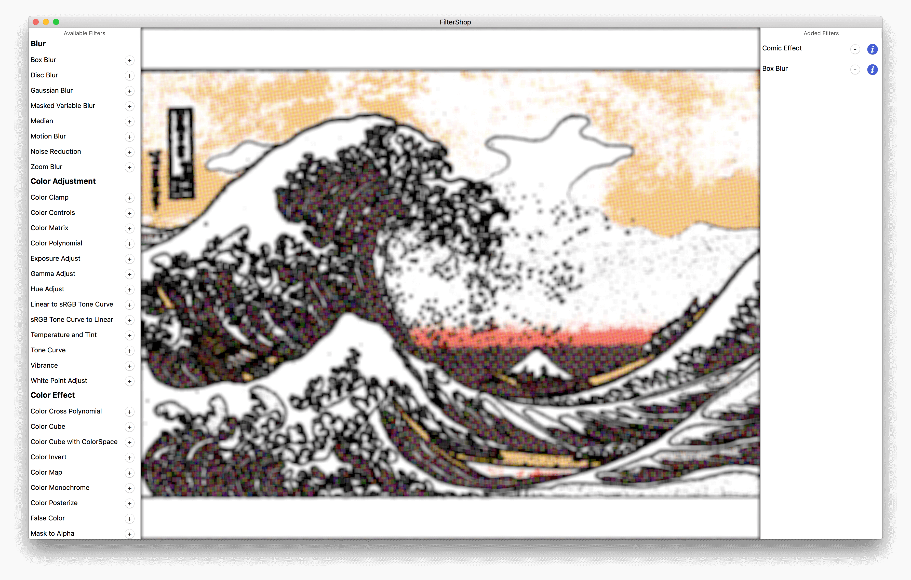

# FilterShop

A macOS App to explore Core Image Filters.

## Features

- [x] drag and drop image files to App
- [x] add filters to see the results
- [x] real time filter effects
- [x] save rendered image
- [x] showcase the filter default parameters

## Notice

- Filters are added to layer until we save the image.
- All Filter use default parameters.
- Some filters are not that applicable to dropped images. So you'll not see obvious changes.
- Should built on macOS 10.10+, only tested on my Mac.

## License

MIT

